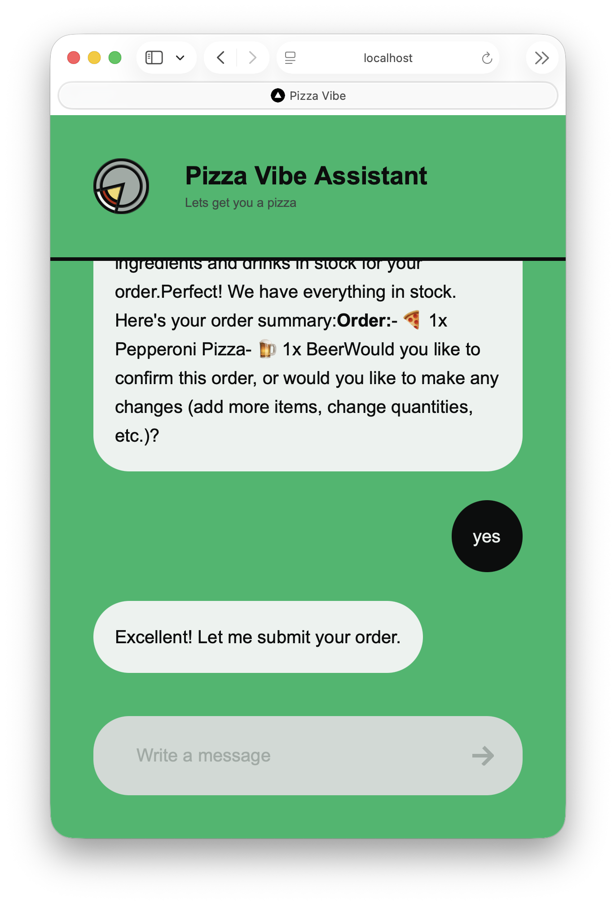
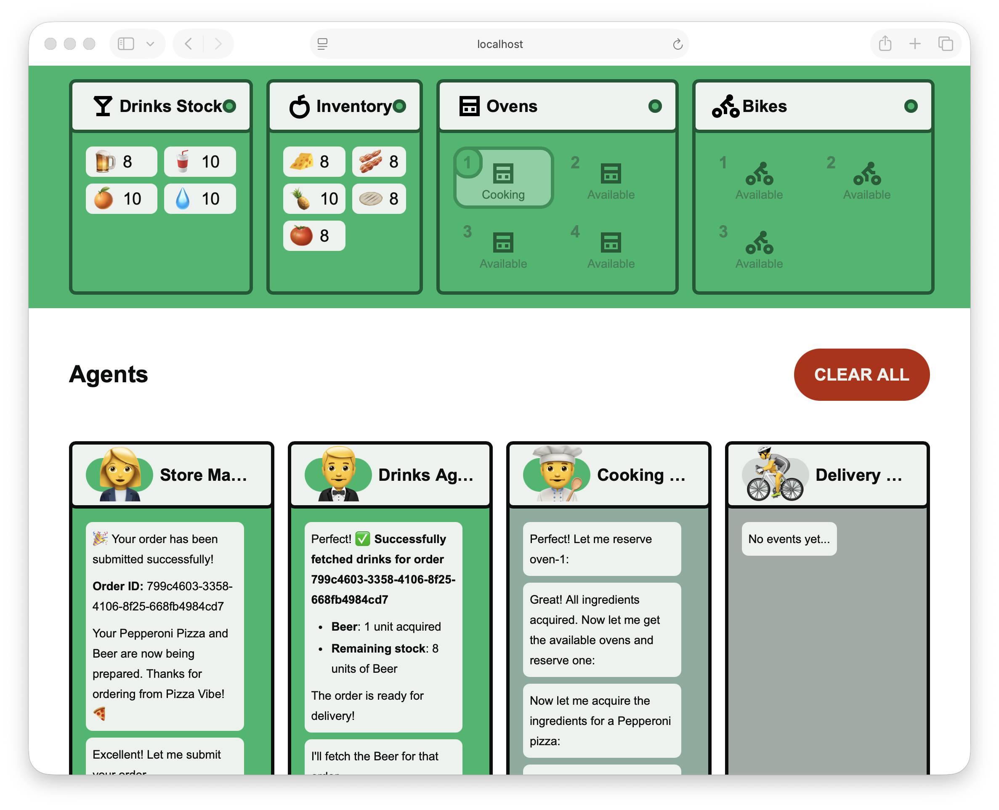
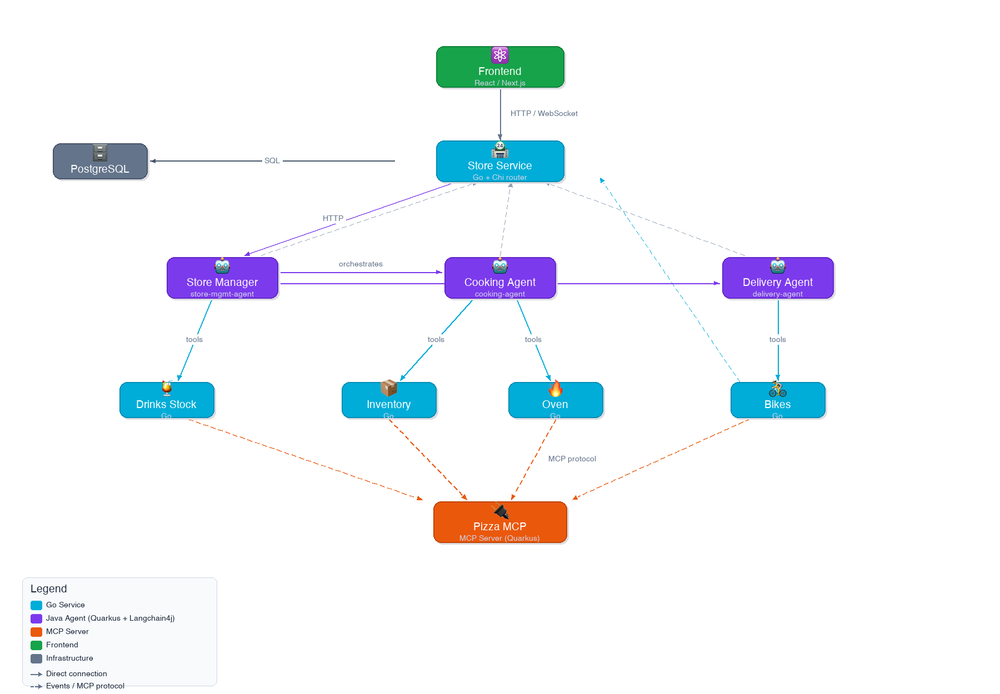

# Pizza Vibe

Pizza Vibe is an agentic pizza store that uses AI agents to orchestrate the entire pizza ordering workflow — from taking your order through a chat interface, to cooking your pizza and delivering it to your door.

Customers interact with a natural language chat assistant that coordinates behind the scenes with specialized AI agents for store management, cooking, and delivery.



An agents dashboard provides real-time visibility into what each agent is doing, along with the status of ovens, bikes, inventory, and drinks stock.



## Getting Started

### Prerequisites

- [kind](https://kind.sigs.k8s.io/) (installed automatically via Homebrew if missing)
- [kubectl](https://kubernetes.io/docs/tasks/tools/)
- [Helm](https://helm.sh/)
- [Docker](https://www.docker.com/)
- **ANTHROPIC_API_KEY** (required) — an [Anthropic API key](https://console.anthropic.com/) for the AI agents
- **DASH0_AUTH_TOKEN** (optional) — a [Dash0](https://www.dash0.com/) token for cloud-based observability

### Setup

```bash
export ANTHROPIC_API_KEY=<your-anthropic-api-key>

# Optional: enable Dash0 observability
export DASH0_AUTH_TOKEN=<your-dash0-token>

./scripts/setup-kind.sh
```

This script creates a KIND Kubernetes cluster, installs Dapr, PostgreSQL, the observability stack (OpenTelemetry + Jaeger), builds all service images, and deploys the full application.

### Accessing the Application

```bash
kubectl port-forward svc/store 8080:8080
# Open http://localhost:8080/chat.html to access the chat interface
# Open http://localhost:8080/agents-dash.html to access the agents dashboard


# Jaeger tracing UI
kubectl port-forward svc/jaeger-query 16686
# Open http://localhost:16686
```

## Architecture



The application follows a multi-agent architecture where a **React/Next.js frontend** communicates with a **Go backend (Store Service)** via HTTP and WebSocket. The Store Service coordinates three **AI agents** (built with Java, Quarkus, and LangChain4j) that use tools exposed by **Go microservices** through an **MCP server**.

### Protocols and Tools

| Technology | Role |
|---|---|
| **A2A (Agent-to-Agent)** | Communication protocol between the Store Service and the AI agents |
| **MCP (Model Context Protocol)** | Protocol used by agents to discover and invoke tools provided by the Go services |
| **Dapr Workflows** | Orchestrates the end-to-end order lifecycle across agents and services |
| **OpenTelemetry** | Distributed tracing and observability across all services (exported to Jaeger and optionally Dash0) |

## Services

| Service | Language | Description |
|---|---|---|
| **store** | Go | Central API gateway and orchestrator. Serves the frontend, manages orders, coordinates agents via A2A, and provides real-time updates over WebSocket |
| **inventory** | Go | Manages pizza ingredient stock and handles ingredient acquisition for pizza preparation |
| **oven** | Go | Manages pizza ovens, tracks availability, and handles oven reservations for cooking |
| **bikes** | Go | Manages a fleet of delivery bikes and handles bike reservations for deliveries |
| **drinks-stock** | Go | Manages beverage inventory, stock levels, and drink acquisition |
| **store-mgmt-agent** | Java (Quarkus) | AI agent that orchestrates the full order workflow using Dapr Workflows, coordinating between cooking and delivery agents |
| **cooking-agent** | Java (Quarkus) | AI agent that handles pizza preparation — acquires ingredients, reserves ovens, and manages cooking |
| **delivery-agent** | Java (Quarkus) | AI agent that handles delivery logistics — reserves bikes and manages the delivery process |
| **pizza-mcp** | Java (Quarkus) | MCP server that exposes inventory, oven, bike, and drinks-stock tools for agents to use |
| **front-end** | React/Next.js | Web UI with a chat interface for ordering pizzas and a dashboard for monitoring agents and resources |